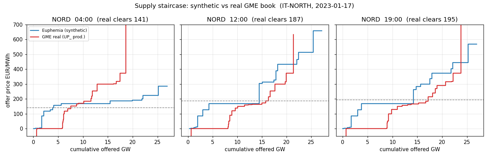

# Validating the counterfactual's core object: our synthetic Italian order books vs the real GME MGP books

**Question.** The Euphemia counterfactual now *captures* the full tagged order
book it clears (per-unit supply/demand ladders per zone-day, tags `RES` /
`IMPORT` / `DEMAND` / `BACKSTOP` / unit-code). Italy is the one large market
whose operator, **GME** (Gestore dei Mercati Energetici), publishes the **real,
full MGP bid/offer book** — every operator's offer, accepted and rejected — with
a 7-day lag. That lets us check the counterfactual against its *core object*
(the book), not just its price output. This note documents the data source, the
comparison method, and an honest verdict of what matches and what does not.

This is an **analysis-only** deliverable. No raw GME data is committed (see
Terms); only derived aggregates (composition shares, percentile prices,
downsampled staircase points) are.

---

## Phase 1 — Source

### What it is

- **Market:** MGP = *Mercato del Giorno Prima* (Italian day-ahead), operator GME.
- **Dataset:** *Offerte Pubbliche* ("public offers") — the full set of submitted
  bids/offers per session, published after the confidentiality embargo.
- **Embargo:** bid/offer data are confidential for **7 days** after the session
  date (Ministerial Decree 29 April 2009). Request only dates older than 7 days.
- **Format:** one `zip` per requested day containing
  `YYYYMMDDMGPOffertePubbliche.xml` — a Microsoft `DataSet` XML dump (one
  `<OfferteOperatori>` element per offer). ~2.9 MB zip / ~110 MB XML for a 2023
  hourly day; ~11 MB zip / ~600 MB XML for a 2026 15-minute day.

### Download recipe (reverse-engineered 2026-07 — no login, but a terms gate)

The public page is a DNN/Angular app. Downloading is a two-step handshake, fully
reproduced by [`scripts/fetch_gme_offers.py`](scripts/fetch_gme_offers.py):

1. `GET https://www.mercatoelettrico.org/it-it/Home/Esiti/Elettricita/MGP/Download/OffertePubbliche`
   — this mints the session cookies (`__RequestVerificationToken`,
   `.ASPXANONYMOUS`) and carries the anti-forgery field value, `ModuleId`
   (12067), `TabId` (1706). The site models "accept the two-checkbox disclaimer"
   as a client-side `GmePolicy=true` cookie.
2. `GET https://www.mercatoelettrico.org/DesktopModules/GmeDownload/API/ExcelDownload/downloadzipfile`
   `?DataInizio=YYYYMMDD&DataFine=YYYYMMDD&Date=YYYYMMDD&Mercato=MGP&Settore=OffertePubbliche&FiltroDate=InizioFine`
   with headers `ModuleId`, `TabId`, `RequestVerificationToken`, `userid:-1` and
   the cookies from step 1 → returns `application/zip`. Without the token/cookies
   the endpoint returns `401 Authorization has been denied`.

```bash
python3 scripts/fetch_gme_offers.py 2023-01-17 2023-04-19 2023-07-19 --out <scratch>
```

### XML fields (`<OfferteOperatori>`)

| field | meaning |
|---|---|
| `PURPOSE_CD` | **`OFF` = sell offer (SUPPLY)**, **`BID` = purchase bid (DEMAND)** |
| `STATUS_CD` | `ACC` accepted, `REJ` rejected, `INC` partial/included; **`REP`/`REV` = superseded prior submissions** |
| `ZONE_CD` | `NORD CNOR CSUD SUD CALA SICI SARD` + foreign virtual zones (`SVIZ FRAN CORS MONT MALT` …) |
| `UNIT_REFERENCE_NO` | `UP_*` production unit, `UC_*` consumption unit, `UVZ*/UCV*` zonal virtual unit (imports / aggregated units) |
| `INTERVAL_NO` (≤2024) / `PERIOD` (2025+) | hour `1..24` / MTU `1..96`; `GRANULARITY` says which |
| `QUANTITY_NO`, `ENERGY_PRICE_NO` | offered MWh, offer price €/MWh |
| `AWARDED_QUANTITY_NO`, `AWARDED_PRICE_NO` | cleared MWh, zonal clearing price |
| `MERIT_ORDER_NO`, `OPERATORE` | GME merit rank, operator name |

Two facts established empirically and used by the parser:
- **The final valid curve is `STATUS ∈ {ACC, REJ, INC}`.** `REP`/`REV` are earlier
  versions of the *same* unit-hour (measured: 46/46 `REV` and 111/113 `REP` units
  in NORD h12 overlap an `ACC`/`REJ` row for the same unit) — including them
  double-counts capacity.
- **Hour convention:** `INTERVAL_NO` = hour + 1 (interval 1 = 00:00–01:00),
  confirmed against the demand-shape peak. So our book hour `H` ↔ interval `H+1`.

### Terms of use

GME's *Condizioni di utilizzo* provide the data free for consultation with a
warranty exclusion, and prohibit any use that violates the General Conditions;
downstream users must accept the same terms. **We therefore do not commit or
redistribute any raw GME file.** This repo carries only derived aggregate
statistics. Keep the raw zip/XML in a git-ignored scratch directory.

### Sample days

Three 2023 weekdays present in our `data/books_cv23/` capture, one per season —
**2023-01-17** (winter), **2023-04-19** (spring), **2023-07-19** (summer) — each
at hours **04:00 / 12:00 / 19:00**, all seven Italian physical zones. (2023 files
are hourly, matching our hourly books cleanly. GME's archive reaches back years,
so these overlap our backfill; note our newer `data/web/v1/books/` daily capture
did not exist yet when this ran.)

**Zone map** (Calabria `CALA` has been a separate bidding zone since 1 Jan 2021,
so it is valid across our whole book range):

`IT-NORTH=NORD  IT-CNORTH=CNOR  IT-CSOUTH=CSUD  IT-SOUTH=SUD  IT-Calabria=CALA  IT-Sicily=SICI  IT-Sardinia=SARD`

---

## Phase 2 — Comparison

Physical apples-to-apples: our **domestic** supply stack (per-unit ladders +
`AGG-*` aggregates + `RES`) vs GME's **domestic production** offers
(`UNIT_REFERENCE_NO` starting `UP_`, `STATUS ∈ {ACC,REJ,INC}`). GME's `UVZ`
virtual-zonal layer (imports / aggregated non-relevant units) is reported
separately, because our per-zone book has no `IMPORT` layer on these days
(imports enter through the network in the coupled clear, not as book orders).

Scripts (runnable, documented):
[`parse_gme_offers.py`](scripts/parse_gme_offers.py) (streaming XML → compact
IT-only parquet), [`compare_books.py`](scripts/compare_books.py) (staircases,
quantiles, composition, clearing), [`rollup_and_figure.py`](scripts/rollup_and_figure.py).
Outputs in [`outputs/`](outputs/): `summary_*.tsv`, `quantiles_*.tsv`, `staircase_*.tsv`,
`rollup.tsv`, `composition_by_zone.tsv`, and one figure.



### Headline (mean over 3 days × 7 zones × 3 hours)

| metric | ours | GME real |
|---|---|---|
| offered domestic supply MW (our / GME-`UP_`) | **1.35×** | 1.00 |
| share of supply offered at price ≤ 0 | **0.00** | **0.45** |
| share in mid band 0–150 €/MWh | 0.60 | 0.22 |
| share offered above 300 €/MWh (cap tail) | 0.10 | 0.11 |
| real zonal clearing price €/MWh | — | 137.4 |
| our SRMC marginal at the cleared depth €/MWh | 156.3 | — |

### Supply-curve shape — price at each percentile of a book's *own* offered volume

| depth pctl | our price | GME price | GME − ours |
|---|---|---|---|
| 10% | 32.4 | **−135.0** | −167.4 |
| 25% | 93.2 | −36.3 | −129.5 |
| 50% | 135.0 | 82.7 | −52.2 |
| 75% | 211.2 | 182.4 | −28.8 |
| 90% | 292.4 | 254.7 | −37.7 |

### What this says

1. **We offer ~35% more domestic supply than the real book does.** Our book
   floats the whole commissioned-and-available fleet at SRMC; the real book
   offers less domestic production per hour (self-scheduling, bilateral cover,
   units simply not offered). Volume ratio 1.15–1.54× across zones.

2. **The real book is bimodal; ours is unimodal — this is the central
   structural gap.** GME's supply front-loads a large **price-taker / must-run
   floor at ≤ 0 €/MWh (27–79% of offered volume, mean 45%)** — hydro, run-of-
   river, cogeneration, and baseload securing dispatch by bidding at the floor —
   and then a discrete **cap-priced tail**. Our synthetic book has **0% at ≤ 0**
   (our `RES` sits at €1 and everything else starts at fuel SRMC ≈ €130–170) and
   piles 60% of its volume in a narrow mid band around gas SRMC. Percentile-for-
   percentile the real curve therefore sits *below* ours through the whole bulk
   (−167 €/MWh at the 10th pctl, −52 at the median).

3. **The cap tail is comparable in size (≈0.10–0.11) but different in kind.**
   Ours is the smooth top of a unit SRMC ladder; the real tail is discrete blocks
   parked at/near the cap — the classic shape of scarcity/withheld capacity.

### The research question — does the real book deviate toward the IT price residuals?

Our standing IT residual is a **peak/evening under-price** (IT zones run €3–14
low; the "July flat-sim" evening bias). The book comparison is **consistent with
that residual being a peak-tail conduct premium, not a broad markup**, and it is
honest about where the evidence stops:

- **Off-peak troughs clear *below* our SRMC floor.** Real NORD 04:00 cleared at
  **€141** while our cheapest dispatchable offers begin at the gas SRMC ≈ €167
  (Jan-2023 TTF). The real market prices the trough on the must-run/import floor
  we structurally cannot represent — so a competitive SRMC book *over*-prices
  troughs.
- **Peak tails carry a premium *above* our SRMC.** In the tight evening hours the
  real clearing (NORD 12:00 €187, 19:00 €195; July 19:00 €205) sits **above** our
  SRMC marginal (≈€167–185), and the real book holds a discrete cap-block tail
  that our competitive ladder does not. An **offered-above-SRMC / withheld-tail**
  signature in exactly the hours we under-price is the market-power channel this
  program looks for — reported as a **candidate finding, hedged**, not a proven
  markup.
- **Caveat that bounds the claim.** This per-zone snapshot omits the import layer
  (real NORD imports ~35% of its energy via `UVZ`; our book here has no `IMPORT`
  orders), so the *net* price-direction attribution belongs to the coupled
  multi-zone clear, not to this single-zone object. The **shape** evidence
  (missing must-run floor, peak cap-tail) is robust; the **price-level** direction
  is only suggestive here.

### Incidental data-quality finding

The comparison surfaced a corrupt capacity in **our** registry: unit
`26WUUUUUUBUSSI19` (IT-CSOUTH, a small plant) carries **13,068,005 MW per
tranche** in the captured book — an ENTSO-E `p_max` error propagated into the
order book. `compare_books.py` guards the curve math by dropping supply rows
> 5,000 MW (no real Italian unit tranche is that large) and reporting the dropped
MW. Worth fixing upstream in `get_generators`.

---

## Reproduce

```bash
scratch=$(mktemp -d)
python3 scripts/fetch_gme_offers.py 2023-01-17 2023-04-19 2023-07-19 --out "$scratch"
for d in 20230117 20230419 20230719; do
  python3 scripts/parse_gme_offers.py "$scratch/${d}MGP_OffertePubbliche.zip" "$scratch/gme_${d}.parquet"
done
python3 scripts/compare_books.py 2023-01-17 data/books_cv23/2023-01-17.parquet "$scratch/gme_20230117.parquet" outputs
python3 scripts/compare_books.py 2023-04-19 data/books_cv23/2023-04-19.parquet "$scratch/gme_20230419.parquet" outputs
python3 scripts/compare_books.py 2023-07-19 data/books_cv23/2023-07-19.parquet "$scratch/gme_20230719.parquet" outputs
python3 scripts/rollup_and_figure.py outputs
```

## Verdict (5 lines)

1. **Source found and automated:** GME MGP *Offerte Pubbliche* download works
   headless via a token+cookie handshake (`fetch_gme_offers.py`); 7-day embargo;
   free-for-consultation terms → **only derived aggregates committed, no raw GME**.
2. **Volumes:** our synthetic book floats **~1.35×** the domestic supply the real
   book actually offers.
3. **Shape (the real gap):** the real book is **bimodal** — a large **≤0 €/MWh
   must-run floor (mean 45% of volume)** plus a cap-priced tail — while ours is a
   **unimodal SRMC stack with 0% at ≤0**; percentile-for-percentile the real curve
   sits below ours.
4. **Direction:** real troughs clear **below** our gas-SRMC floor (we over-price
   troughs); real evening peaks carry a **cap-tail premium above** our SRMC in
   exactly the hours we under-price — a *candidate* withheld-capacity / offered-
   above-SRMC signature, hedged.
5. **Bounds:** this single-zone book omits imports, so it **validates the book's
   shape** and localizes the residual to the peak tail, but the net price-level
   attribution needs the coupled multi-zone clear.
