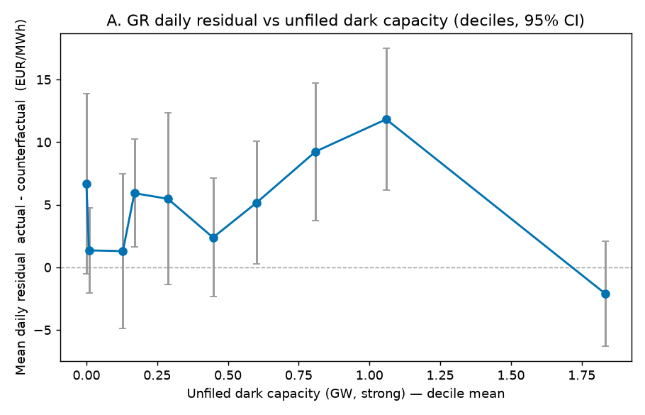
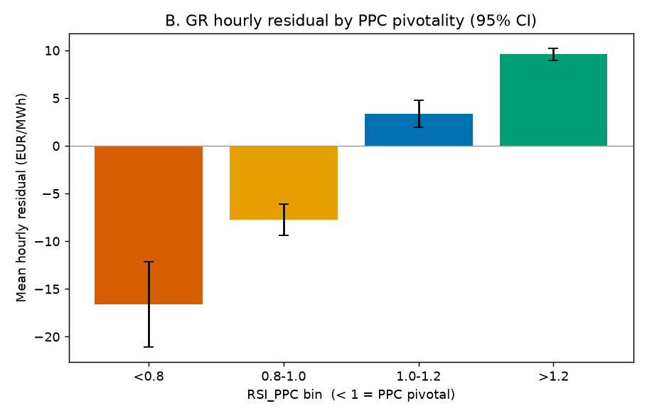
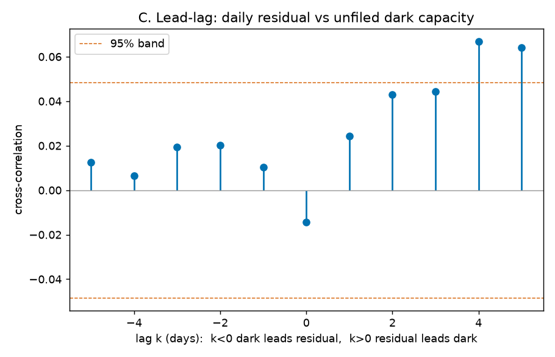
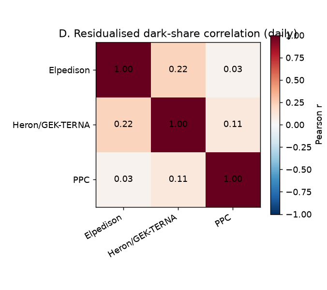

# Phase B — statistical attribution of the competitive-counterfactual residual

*Market-monitoring research. Everything below is a set of CANDIDATE hypotheses
tested against public ENTSO-E data and a competitive counterfactual. Findings
are NOT accusations of collusion; for every result the alternative
(non-strategic) explanations the data cannot rule out are stated explicitly.
Every number traces to `analysis/phase_b/results.txt`, the committed stdout of
`analysis/phase_b/04_regressions.py`.*

## Question

The v10 "competitive counterfactual" (`simulations.energy_prices`,
`code_version=10, order_method='merit_order'`) reconstructs SEE day-ahead prices
from unit-level SRMC merit order. For Greece it tracks actuals well (per-year
mean residual +21.6 / −0.1 / +1.8 / +1.9 / −7.8 €/MWh for 2022…2026, corr
0.63–0.82). **Phase B asks whether the day-to-day residual (actual −
counterfactual) is systematically associated with observable strategic-behaviour
signals** — unfiled dark capacity, incumbent pivotality, and cross-firm
co-movement — or whether it is noise/common-cost residual.

All primary tests are **GR-only**: v10 is the validated core there, and it
over-prices BG/RO in 2025–26 (residuals to −126 €/MWh), so those zones appear
only in clearly-labelled appendix/robustness contexts and not in any primary
regression here.

## Data and construction

Three support tables are built in SQL (reproducible, DROP+CREATE), then read by
the regression script. Run order and exact commands are in
`analysis/phase_b/README.md`.

| Table | Grain | Rows | Builder |
|---|---|---|---|
| `simulations.phase_b_daily` | GR day, 2022-01-01…2026-06-30 | 1642 | `01_build_phase_b_daily.sql` |
| `simulations.rsi_hourly` | GR hour | 39383 | `02_build_rsi_hourly.sql` |
| `simulations.phase_b_firm_dark` | firm × day (3 firms) | 4926 | `03_build_firm_dark_share.sql` |

**Timezone discipline.** `entsoe.*` `date_time_utc` are `timestamp WITH time
zone` (true UTC instants rendered Europe/Berlin by the session); `simulations.*`
are naive UTC. Every join/extract uses `(entsoe_col AT TIME ZONE 'UTC')` so the
two align on the same UTC instant/date. All aggregation is by UTC calendar date
/ UTC hour bucket. `unfiled_dark_units.day` (market/local day) is joined directly
to the UTC date — a ≤1 h boundary approximation on a daily aggregate.

**Signals in `phase_b_daily`:** daily avg actual (`entsoe.energy_prices`, GR
Day-ahead) and v10 multi-zone sim price; `residual = actual − sim`;
`dark_mw` = Σ p_max of `unfiled_dark_units` GR rows with `strong=true` that day;
`dark_mw_all` = same without the strong filter; `peak_net_demand` = max over the
day's hours of (load forecast − wind − solar forecast); `res_share` = daily RES
forecast ÷ load forecast; `ttf_change_5d` = TTF D−1 close minus its close 5
trading days earlier; `eua_dm1` = EUA D−1 close; `reservoir_pct` = GR hydro
stored-energy as % of the full-history max (latest weekly value ≤ day);
`reservoir_deviation` = that % minus the same-ISO-week median of prior years;
`outage_mw` = Σ Active-outage derate (installed − MIN available_capacity) for GR
that day; `regulated_dummy` = 2022-07-01…2022-12-31 (Greek generation-revenue
cap); weekday/month/year. Power quantities are hour-averaged so they are robust
to the mixed PT15M/PT60M forecast resolution.

**RSI in `rsi_hourly`:** `RSI_PPC(h) = (total_available(day) − PPC_available(day)
+ max(net_import(h),0)) / net_demand(h)`. `total_available` = full deduped GR
generation fleet (`DISTINCT ON (generation_unit_code)`), each unit reduced to its
Active-outage `available_capacity_mw` that day (MIN per unit-day, clamped to
[0, installed]); `PPC_available` = PPC-mapped subset under the same rule;
`net_import(h)` from `entsoe.physical_flows` (per-hour AVG per raw border,
counterparties normalised by alpha prefix so IT / IT-SOUTH / IT_GR / IT-Brindisi
collapse to one IT row keeping the larger |flow|, mirroring the `_IPS`-suffix
dedup; imports − exports summed with sign). Net demand = hourly load − wind −
solar forecast.

## Verdict summary

| # | Hypothesis (candidate) | Verdict | Headline effect size |
|---|---|---|---|
| A / H1 | Unfiled dark capacity raises the residual | **Not supported** | strong dark_mw **+2.69 €/MWh per GW**, 95% CI **[−0.57, +5.96]**, p=0.106; sign flips to −0.79 (p=0.47) once the 2022 regulated window is dropped |
| B / H2 | PPC pivotality (RSI<1) raises the residual | **Not supported (opposite sign)** | RSI<1 hourly dummy **−19.8 €/MWh**, 95% CI **[−23.5, −16.0]**, p<0.001 — pivotal hours have a *lower* residual, i.e. the counterfactual if anything over-prices scarcity |
| C / H3 | dark × pivotal / fuel-specific / lead-lag (exploratory) | **Inconclusive / weakly suggestive** | dark×daily-pivotal **+5.15 €/MWh per GW** extra, CI [−0.38, +10.67], p=0.068; thermal dark point-positive but n.s.; dark does not lead the residual |
| D / H4 | Cross-firm co-movement of dark-share (first-pass coordination) | **Inconclusive / weak** | Elpedison–Heron residualised r **+0.22** daily (p<1e-4), **+0.17** weekly (p=0.009); dominant firm PPC uncorrelated with rivals; consistent with common unobserved drivers |

**Overall:** the core withholding-markup story (H1, H2) is **not supported** by
the pre-specified primary tests. This is a genuine, publishable null — the GR
residual, once year fixed effects and cost/demand/hydro controls are in, is not
systematically explained by unfiled dark capacity, and pivotal hours carry a
*negative* residual rather than the positive markup the hypothesis predicts. The
exploratory and cross-firm results (H3, H4) are weak and equally consistent with
common cost/weather drivers as with strategic behaviour.

---

## A. Residual × unfiled dark capacity (primary)

Regression (HAC/Newey-West SE, lag 7):
`residual ~ dark_mw + peak_net_demand + res_share + ttf_change_5d +
reservoir_deviation + outage_mw + regulated_dummy + year FE`, n=1641, R²=0.30.

| term | coef | 95% CI | p |
|---|---|---|---|
| **dark_mw** (per MW) | +0.0027 | [−0.0006, +0.0060] | 0.106 |
| **dark_mw → per GW** | **+2.69 €/MWh** | **[−0.57, +5.96]** | 0.106 |
| peak_net_demand | +0.0022 | [−0.0013, +0.0057] | 0.22 |
| res_share | −25.9 | [−45.5, −6.3] | 0.010 |
| ttf_change_5d | −0.96 | [−1.35, −0.57] | <0.001 |
| reservoir_deviation | −1.11 | [−1.48, −0.73] | <0.001 |
| outage_mw (per MW) | +0.0048 | [+0.0024, +0.0072] | <0.001 |
| regulated_dummy | −10.5 | [−33.4, +12.4] | 0.37 |

The dark-capacity coefficient is **positive but not significant** (+2.69 €/MWh
per GW, CI spans zero). Two robustness cuts:

- **Excluding the 2022 regulated window** (n=1457): dark_mw = **−0.79 €/MWh per
  GW**, CI [−2.92, +1.35], p=0.47 — the point estimate flips sign and stays
  null. The weak positive in the full sample is carried by 2022 H2, exactly the
  regulated period the spec flags.
- **`dark_mw_all`** (strong filter dropped, n=1641): **+4.15 €/MWh per GW**, CI
  [+1.37, +6.93], p=0.003 — significant but small, and this variant folds in
  weak single-sided dark units and shares the in-merit endogeneity caveat below.

The controls behave sensibly and are the real signal: outage MW, a 5-day TTF
*drop* (mean-reversion of the residual after gas spikes), reservoir dryness
(`reservoir_deviation` negative → residual up), and RES share all load
significantly; dark capacity does not.

Binned scatter (residual vs `dark_mw` deciles, 95% CI): weak, non-monotonic —
residual rises through the 8th decile (~1.0 GW dark → +11.8 €/MWh) then falls in
the top decile (~1.8 GW → −2.1). No clean dose-response.



**Alternative explanations (not ruled out):** the in-merit criterion in
`unfiled_dark_units` uses *actual* prices, so `dark_mw` is mildly mechanically
correlated with high-price days (endogeneity); the `dark_mw_all` and strong-only
contrast is the mitigation, and it removes the significance. Dark units are also
disproportionately hydro/pumped storage that is legitimately energy-limited
(water value), not withheld.

## B. Pivotality (RSI_PPC) — primary

Share of GR hours with `RSI_PPC < 1` (PPC pivotal), by year:
**17.6 / 10.6 / 19.2 / 29.0 / 19.5 %** (2022…2026). PPC is pivotal in a
material and rising share of hours — the *enabling condition* for withholding is
frequently present.

Hourly residual by RSI bin (95% CI):

| RSI_PPC bin | mean residual | 95% CI | n |
|---|---|---|---|
| < 0.8 (deeply pivotal) | **−16.6** | ±4.5 | 2078 |
| 0.8–1.0 (pivotal) | **−7.7** | ±1.7 | 4917 |
| 1.0–1.2 | +3.4 | ±1.4 | 5917 |
| > 1.2 (comfortable) | +9.6 | ±0.6 | 24153 |

The residual **rises monotonically with RSI** — the *opposite* of the withholding
prediction. When PPC is pivotal, the counterfactual sits *above* the actual
(negative residual); when supply is comfortable it sits below.

Hourly regression (same controls as A, hourly net demand, RSI<1 dummy added; HAC
lag 24, n=39359, R²=0.14): the **RSI<1 dummy = −19.8 €/MWh** (CI [−23.5, −16.0],
p<0.001). `dark_mw` here is +1.0 €/MWh per GW (p=0.34, null).



**Interpretation.** This is not evidence of competitive pricing per se — it says
the *counterfactual* becomes relatively more aggressive than the actual exactly
in tight hours. The mechanical driver: low RSI coincides with high net demand,
where the merit-order counterfactual climbs a steep gas/scarcity part of the
supply curve; the model over-shoots there. So B is a **statement about model
behaviour in scarcity as much as about the market** — it rules out a simple
"pivotal ⇒ positive markup" reading but cannot, on its own, exonerate withholding
(a withheld unit would also raise the *actual*; here the actual is *below* the
model, so if withholding occurs its price effect is smaller than the model's
scarcity climb). Reported straight as a null on the hypothesised direction.

## C. Signal-catalogue variants — EXPLORATORY

*Labelled exploratory; not part of the pre-specified primary tests.*

- **C1 — dark_mw × (daily-min RSI_PPC < 1):** the interaction is
  **+5.15 €/MWh per GW** extra on pivotal days (CI [−0.38, +10.67], p=0.068)
  while the base `dark_mw` goes to −0.28 (p=0.91). Reading: any positive
  association of dark capacity with the residual is confined to days when PPC is
  pivotal — the direction a strategic story would predict — but it is only
  borderline (p≈0.07) and fragile.
- **C2 — dark_mw split by fuel:** gas **+3.35** (p=0.16), lignite **+4.19**
  (p=0.23), hydro **−0.31 €/MWh per GW** (p=0.92). Thermal dark capacity carries
  the (insignificant) positive sign; hydro dark is a clean null — consistent with
  hydro darkness being water-value scheduling, not withholding.
- **C3 — lead-lag cross-correlogram** (residual_t vs dark_{t+k}, ±5 days): all
  |r| < 0.07. Dark capacity does **not** rise before high-residual days (k<0 all
  ≈ +0.01…+0.02); the only mildly-positive lags are k=+4/+5 (residual leads dark,
  r≈+0.065). No predictive/leading pattern.



## D. Cross-firm dark-share correlation — primary (first-pass)

Only three GR firms have ≥2 mapped units in `unit_firms`: **PPC** (10.4 GW),
**Elpedison** (0.81 GW), **Heron/GEK-TERNA** (0.57 GW). Each firm's
`dark_share = strong-dark MW ÷ mapped capacity` is regressed on the common
signal set (controls from A, no dark terms); the residuals are correlated
pairwise.

Daily residualised-dark-share correlations (n=1642 days):

| pair | r | p |
|---|---|---|
| Elpedison × Heron/GEK-TERNA | **+0.221** | <0.0001 |
| Heron/GEK-TERNA × PPC | +0.108 | <0.0001 |
| Elpedison × PPC | +0.033 | 0.18 (null) |

Weekly-averaged (n=236 weeks, mitigates day-to-day autocorrelation):

| pair | r | p |
|---|---|---|
| Elpedison × Heron/GEK-TERNA | **+0.170** | 0.009 |
| Heron/GEK-TERNA × PPC | +0.021 | 0.74 (vanishes) |
| Elpedison × PPC | −0.014 | 0.83 (null) |



**Reading.** The one correlation that survives weekly aggregation is between the
two *smaller* firms (Elpedison–Heron, r≈+0.17). The dominant firm (PPC) is
essentially uncorrelated with either rival — the opposite of what a
PPC-led-coordination story would predict. **Interpretation guardrail:**
correlated dark-share residuals are equally consistent with common *unobserved*
drivers (gas-nomination constraints, regional weather/hydrology, shared merchant
economics) as with coordination. With only three firms and provisional
name-rule firm attribution, this is a weak, first-pass signal — **inconclusive**.

---

## Caveats (binding on every claim above)

1. **In-merit endogeneity.** `unfiled_dark_units`' in-merit filter uses actual
   day-max prices, so dark capacity is mildly mechanically correlated with
   high-price (high-residual) days. Mitigation used: strong-only primary +
   `dark_mw_all` contrast; the significance is *not* robust across them.
2. **Provisional firm mapping.** `unit_firms` is name-rule v1; GR attributions
   (PPC, Mytilineos, Elpedison, Heron/GEK-TERNA, Korinthos Power) are solid but
   still metadata, not ground truth. D rests on 3 firms only.
3. **Regulated window.** Jul–Dec 2022 GR actuals were under the Greek
   generation-revenue cap; flagged with a dummy in every regression and A is
   reported with and without it (the dark result depends on it).
4. **Single counterfactual run.** The residual is defined against one v10
   multi-zone reconstruction; it inherits that model's structural choices (ATC
   footprint GR–BG–RO, observed-import handling). B in particular partly reflects
   the counterfactual's scarcity behaviour, not only the market's.
5. **v10 BG/RO limitation.** v10 over-prices BG/RO in 2025–26; all primary tests
   are GR-only for that reason. No BG/RO regression is run here.
6. **RSI universe.** `total_available` is the full GR generation fleet, but
   production-level-only outages (asset codes that match a production but not a
   generation unit code) are not applied to the fleet derate — a minor
   under-derate. Imports use observed physical flows, not day-ahead ATC.

## Reproducing

See `analysis/phase_b/README.md`. In short, from the repo root with `.env`
present:

```bash
set -a; source .env; set +a
psql "$ENERGY_CONN_STR" -f analysis/phase_b/01_build_phase_b_daily.sql
psql "$ENERGY_CONN_STR" -f analysis/phase_b/02_build_rsi_hourly.sql
psql "$ENERGY_CONN_STR" -f analysis/phase_b/03_build_firm_dark_share.sql
uv run --with pandas,numpy,statsmodels,matplotlib,scipy,psycopg2-binary \
    python3 analysis/phase_b/04_regressions.py | tee analysis/phase_b/results.txt
```
